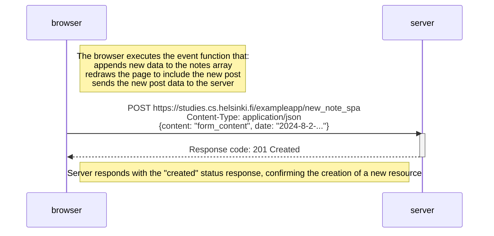

```mermaid
sequenceDiagram
    participant browser
    participant server

    Note right of browser: The browser executes the event function that:<br> appends new data to the notes array<br>redraws the page to include the new post<br>sends the new post data to the server
    browser->>server: POST https://studies.cs.helsinki.fi/exampleapp/new_note_spa <br> Content-Type: application/json <br>{content: "form_content", date: "2024-8-2-..."}
    activate server
    server-->>browser: Response code: 201 Created
    deactivate server
    Note left of server: Server responds with the "created" status response, confirming the creation of a new resource


```
